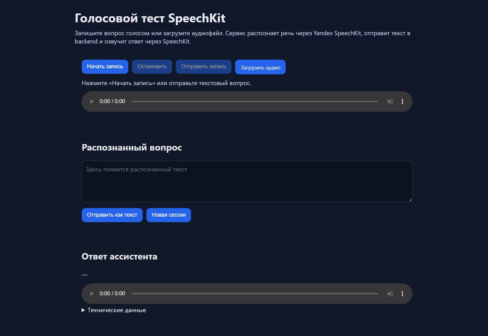
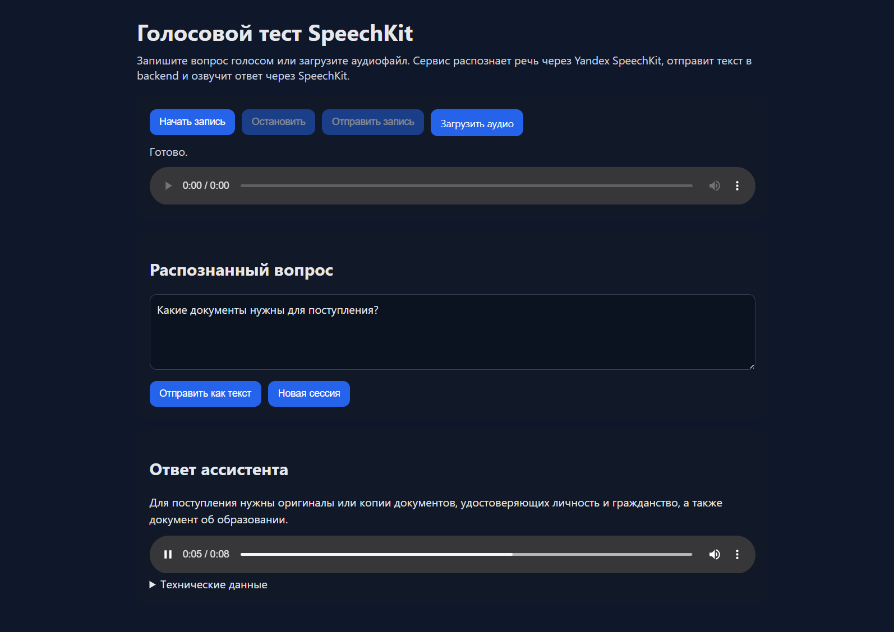
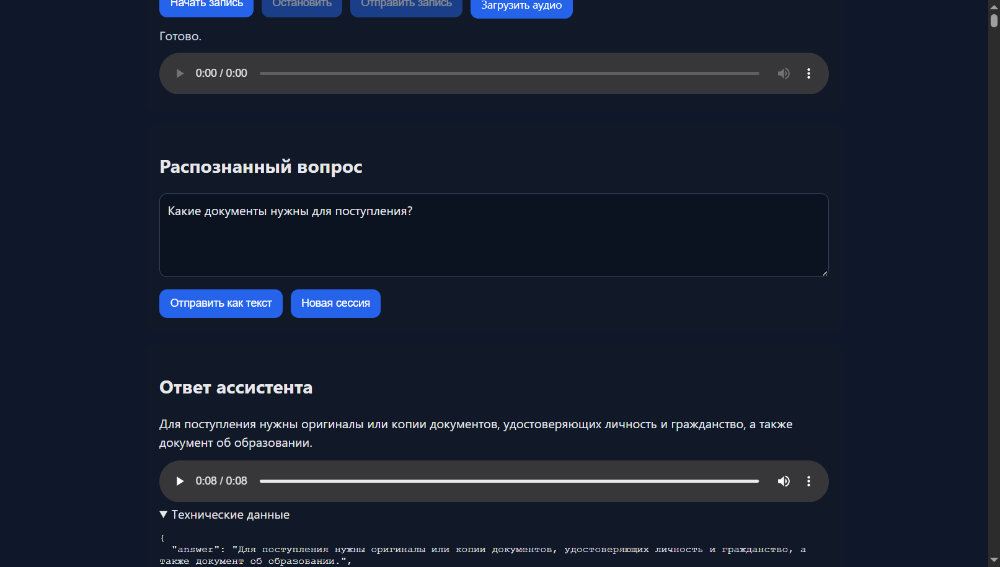

# Спецификация текущего GUI voice-gateway (baseline для рерайта)

> Документ фиксирует **фактическое** поведение работающего сервиса на момент снятия
> спецификации: 2026-07-30, версия backend `app = FastAPI(title="DVUI Voice Gateway", version="10.2.1")`.
> Источники: чтение `index.html` / `app.js` / `styles.css` / `main.py` + живое взаимодействие через
> chrome-devtools (Chrome, локальный запуск `http://localhost:8010/`). Всё, что не подтверждено живым
> запросом, помечено «(из кода)»; неустановленные детали помечены `[НЕ УСТАНОВЛЕНО]`.

Файлы-источники (только чтение, ничего не менялось):
- `E:\voice-agent\enrollment-assistant\services\voice-gateway\app\static\index.html`
- `E:\voice-agent\enrollment-assistant\services\voice-gateway\app\static\app.js`
- `E:\voice-agent\enrollment-assistant\services\voice-gateway\app\static\styles.css`
- `E:\voice-agent\enrollment-assistant\services\voice-gateway\app\main.py`
- `E:\voice-agent\enrollment-assistant\services\voice-gateway\app\audio_codec.py`
- `E:\voice-agent\enrollment-assistant\services\voice-gateway\app\call_session.py`
- `E:\voice-agent\enrollment-assistant\services\voice-gateway\app\prompts.py`
- `E:\voice-agent\enrollment-assistant\services\voice-gateway\app\config.py`

---

## 1. Общий обзор

Одностраничное HTML-демо (`title`: «Voice demo — приемная комиссия», `<html lang="ru">`), отдаётся
FastAPI-эндпоинтами `GET /` и `GET /demo` (оба возвращают тот же `index.html` как `HTMLResponse`).
Статика (`app.js`, `styles.css`) смонтирована через `StaticFiles` на `/static`. JS подключается с
cache-buster `?v=2`.

Страница — тестовый стенд голосового ассистента приёмной комиссии вуза: пользователь либо
записывает вопрос голосом / грузит аудиофайл, либо печатает текст; сервис через backend (RAG) даёт
текстовый ответ и озвучивает его (TTS), плюс показывает «технические данные» — сырой JSON ответа
backend.

### Структура layout

`<main class="wrap">` (max-width 900px, по центру) содержит:

1. `<h1>` «Голосовой тест SpeechKit» + вводный абзац `.lead`.
2. **Карточка 1** (`section.card`) — блок записи: 3 кнопки + upload-label + строка статуса + `<audio id="micPreview">` (плеер предпрослушки записи/загруженного файла).
3. **Карточка 2** (`section.card`) — «Распознанный вопрос»: `<textarea id="transcript">` + 2 кнопки.
4. **Карточка 3** (`section.card`) — «Ответ ассистента»: `<div id="answer">` + `<audio id="answerAudio">` (плеер ответа) + `<details>` «Технические данные» с `<pre id="meta">`.

Тема: `color-scheme: light dark` + `@media (prefers-color-scheme: dark)` — автоматическая
светлая/тёмная тема по системным настройкам браузера, переключателя в UI нет.

Заголовок вкладки берёт стандартный favicon браузера — файла `favicon.ico` на сервере нет
(см. §5, `GET /favicon.ico` → 404, дважды в captured traffic; не влияет на функциональность).

---

## 2. Полная инвентаризация элементов управления

| DOM id / селектор | Видимый текст (RU) | Тип | Действие | Условия enabled/disabled | JS-обработчик (app.js) | Backend-эндпоинт |
|---|---|---|---|---|---|---|
| `#startBtn` | «Начать запись» | `<button>` | Запускает запись микрофона (`startRecording()`): создаёт сессию (`ensureCall`), запрашивает `getUserMedia`, поднимает `AudioContext`/`ScriptProcessorNode` | Включена изначально; после клика `disabled=true`, снова `disabled=false` при `stopRecording()` | `startBtn.addEventListener('click', ...)` → `startRecording()` | косвенно `POST /calls/start` (через `ensureCall`) |
| `#stopBtn` | «Остановить» | `<button>` | Останавливает запись (`stopRecording()`): отключает processor/source, закрывает `AudioContext`, останавливает треки стрима, кодирует записанные сэмплы в WAV, выставляет `micPreview.src` | `disabled` в HTML изначально; включается (`disabled=false`) внутри `startRecording()`; после клика снова `disabled=true` | `stopBtn.addEventListener('click', ...)` → `stopRecording()` | нет (только клиентская обработка) |
| `#sendBtn` | «Отправить запись» | `<button>` | Отправляет записанный WAV-блоб на распознавание+ответ (`sendAudio(recordedBlob)`) | `disabled` в HTML изначально; `false` после `stopRecording()`; при клике логика — только если `recordedBlob` truthy (`sendBtn.addEventListener(... recordedBlob && sendAudio(...))`); кнопка визуально не блокируется на время запроса (JS не выставляет `disabled=true` при отправке) | `sendBtn.addEventListener('click', ...)` | `POST /calls/{call_id}/recognize-and-answer` |
| `#fileInput` (обёрнут в `label.upload`, видимый текст кнопки — `<span>Загрузить аудио</span>`) | «Загрузить аудио» | `<input type="file" accept=".wav,.ogg,.mp3,audio/*">` (сам input скрыт `display:none`, кликабелен через `label`) | При выборе файла: `recordedBlob = file`, `micPreview.src` = object URL, сразу вызывает `sendAudio(file, file.name)` (автоотправка без доп. клика) | Всегда доступен | `fileInput.addEventListener('change', ...)` | `POST /calls/{call_id}/recognize-and-answer` |
| `#transcript` | placeholder «Здесь появится распознанный текст» | `<textarea rows="4">` | Поле ввода/отображения текста вопроса; пользователь может печатать вручную ИЛИ поле заполняется автоматически после STT (`transcriptEl.value = payload.transcript`) | Всегда доступно (не disabled) | значение читается в `sendText()` через `transcriptEl.value.trim()` | — |
| `#askTextBtn` | «Отправить как текст» | `<button>` | Отправляет текущее содержимое `#transcript` как текстовый вопрос (`sendText()`); если поле пустое — функция тихо завершается (`if (!text) return;`), никакого запроса и сообщения об ошибке | Всегда enabled (JS не блокирует кнопку) | `askTextBtn.addEventListener('click', ...)` → `sendText()` | `POST /calls/{call_id}/turn` |
| `#newSessionBtn` | «Новая сессия» | `<button>` | Сбрасывает состояние клиента: `call = null`, очищает `#transcript`, `#answer` (→ «—»), `#answerAudio.src`, `#meta`; ставит статус «Создаю новую сессию...»; сразу вызывает `ensureCall()` | Всегда enabled | `newSessionBtn.addEventListener('click', ...)` (async) | `POST /calls/start` |
| `#micPreview` | — (без подписи) | `<audio controls>` | Плеер прослушивания собственной записи/загруженного файла (не ответа ассистента) | Изначально `disabled`-подобное состояние (нет `src`); появляется `src` после `stopRecording()`/выбора файла | заполняется напрямую (`micPreview.src = URL.createObjectURL(...)`), без промежуточного JS-хендлера воспроизведения | — (client-side blob URL) |
| `#answerAudio` | — (без подписи) | `<audio controls>` | Плеер озвученного ответа ассистента; воспроизведение запускается программно (`answerAudio.play()`) сразу после получения ответа | Без `src` до первого ответа | заполняется в `playAssistantAudio(payload)`, вызывается из `ensureCall()` (приветствие), `sendAudio()`, `sendText()` | источник — `data:` URI (`audio_base64`) либо `GET /audio/{name}` (`audio_url`) как fallback |
| `<details>` / `<summary>` «Технические данные» | «Технические данные» | `<details>`/`<summary>` (нативный HTML disclosure) | Разворачивает/сворачивает блок `<pre id="meta">` с сырым JSON ответа | Всегда доступен, состояние (open/closed) не сохраняется между сессиями/запросами | нет JS-обработчика — чистое нативное поведение `<details>` | — |

Все кнопки — обычные `<button>` без `type="submit"` (нет `<form>` на странице, Enter не сабмитит).

---

## 3. Все отображаемые поля вывода

| DOM id | Что показывает | Формат | Когда появляется/меняется |
|---|---|---|---|
| `#status` | Статусная строка одной фразой | Обычный текст, полностью заменяется каждый раз (`statusEl.textContent = text`) | Меняется на каждом шаге: начальный текст → «Идет запись. Говорите вопрос.» → «Запись готова. Можно отправить.» → «Распознаю и формирую ответ...» / «Отправляю текст в backend...» → «Готово.» / «Ответ получен, но озвучка не удалась: {audio_error}» / «Ответ получен. Нажмите Play, если браузер заблокировал автозапуск.» / тексты ошибок вида «Ошибка записи: …», «Ошибка отправки: …», «Ошибка текста: …», «Ошибка загрузки: …», «Ошибка остановки: …» (перехват исключений в `.catch()` у каждого обработчика) |
| `#transcript` (как output) | Распознанный текст вопроса (STT) | Текст в `<textarea>` | Перезаписывается после `sendAudio()`: `transcriptEl.value = payload.transcript || ''`. При текстовом вводе — не трогается программно (пользователь вводит сам) |
| `#answer` | Финальный текстовый ответ ассистента | `white-space: pre-wrap` текстовый блок | Изначально «—»; после ответа — `payload.answer || payload.tts_text || '—'` |
| `#answerAudio` | Аудио-ответ ассистента (проигрыватель) | нативный HTML5 `<audio controls>`, воспроизводит `data:audio/wav;base64,...` либо URL `/audio/{name}` | `src` выставляется и грузится (`.load()`) при каждом успешном ответе; при неудаче TTS остаётся пустым/старым |
| `#meta` | Сырой JSON последнего ответа backend/voice-gateway | `<pre>` c `JSON.stringify(payload, null, 2)` (полный payload включая `audio_base64`) | Заполняется при каждом ответе (`/turn` или `/recognize-and-answer`); НЕ заполняется при создании сессии (`ensureCall`) — там `meta` не трогается |

Отдельных «таймеров», «latency-индикаторов» или «метрик» **в самом GUI нет** — таймингов
(`timings_ms`, `generation.tps` и т.п.) на экране не видно, они присутствуют только внутри
развёрнутого JSON в `#meta`. Никакого отдельного error-banner компонента нет — ошибки идут только
через текст `#status`.

---

## 4. Состояния UI

Явной state machine (enum/переменной состояния) в коде нет — состояние размазано по
`disabled`-атрибутам кнопок и тексту `#status`. Ниже — состояния, восстановленные по логике `app.js`:

1. **idle (начальная загрузка)** — `startBtn` enabled, `stopBtn`/`sendBtn` disabled, статус
   «Нажмите «Начать запись» или отправьте текстовый вопрос.», `#answer` = «—», плееры без `src`.
2. **recording** — вход через клик `#startBtn` → `startRecording()`: сначала `await ensureCall()`
   (если сессии ещё нет — см. состояние 6), затем `getUserMedia` + `AudioContext`.
   `startBtn.disabled=true`, `stopBtn.disabled=false`, `sendBtn.disabled=true`, статус «Идет запись.
   Говорите вопрос.». Пока это состояние активно, `processor.onaudioprocess` копит `Float32Array`
   чанки в `recordedChunks`.
3. **recorded (готово к отправке)** — вход через клик `#stopBtn` → `stopRecording()`: WAV
   кодируется из накопленных сэмплов, `micPreview.src` выставлен. `stopBtn.disabled=true`,
   `startBtn.disabled=false`, `sendBtn.disabled=false`, статус «Запись готова. Можно отправить.».
4. **uploading/thinking (аудио)** — вход через клик `#sendBtn` (blob) или `change` на `#fileInput`
   (файл) → `sendAudio()`: статус «Распознаю и формирую ответ...» сразу после входа в функцию, ДО
   сетевого запроса. Кнопки в этом состоянии JS не блокирует (можно повторно нажать `sendBtn`, если
   `recordedBlob` уже есть — гонки не защищены).
5. **thinking (текст)** — вход через клик `#askTextBtn` → `sendText()` (при непустом `#transcript`):
   статус «Отправляю текст в backend...», запрос `POST /calls/{call_id}/turn`.
6. **creating session** — внутреннее под-состояние, вызывается лениво из `ensureCall()` при первом
   действии пользователя (запись или текст), либо явно через «Новая сессия»: `call` в памяти JS
   пуст → `POST /calls/start` → сразу пытается проиграть приветствие (`playAssistantAudio(call)`).
   Статус «Сессия создана. Можно задавать вопрос.» или, если TTS приветствия упал,
   «Сессия создана, но озвучка приветствия не удалась: {audio_error}».
7. **answered / speaking** — после успешного ответа (`sendAudio`/`sendText`): `#answer`, `#meta`
   заполнены, `answerAudio` пытается автоплей. Три под-варианта финального статуса:
   - озвучка удалась и проигралась → «Готово.»
   - `payload.audio_error` присутствует → «Ответ получен, но озвучка не удалась: {audio_error}»
   - озвучка есть (`audio_url`), но автоплей браузером заблокирован (`played === false`) →
     «Ответ получен. Нажмите Play, если браузер заблокировал автозапуск.»
8. **error** — любой `catch` в цепочке `.catch(err => setStatus('Ошибка …: ' + err.message))` на
   верхних обработчиках событий (`startBtn`, `stopBtn`, `sendBtn`, `fileInput`, `askTextBtn`).
   Также псевдо-ошибочные состояния внутри «успешного» ответа: backend/voice-gateway может вернуть
   200 с текстом-переспросом («Я не расслышал ответ. Повторите, пожалуйста, ещё раз.») при пустом
   транскрипте или сбое STT — это НЕ HTTP-ошибка, а нормальный ответ с `meta.repeat_prompt: true`
   (см. `_repeat_prompt()` в `main.py`), GUI отображает его как обычный ответ.
9. **new session (сброс)** — клик «Новая сессия»: мгновенно чистит весь output (`#transcript`,
   `#answer`→«—», `#answerAudio.src`='', `#meta`=''), статус «Создаю новую сессию...», затем как
   состояние 6.

Переходы между 2↔3 идут только вручную (Начать→Остановить), между 4/5→7 — автоматически по ответу
сети. Нет переходов «отмена записи» (нет кнопки Cancel) и нет тайм-аута ожидания ответа на стороне
клиента (запрос ждётся сколько угодно, `fetch` без `AbortController`/timeout).

---

## 5. Сетевой контракт

Все запросы — same-origin к `http://localhost:8010`. Ниже — то, что реально вызывает GUI
(`app.js`), подтверждено live-трафиком (`list_network_requests`/`get_network_request`) для двух
первых эндпоинтов.

### 5.1 `POST /calls/start`

- Вызывается из: `ensureCall()` — лениво при первом действии пользователя, либо явно из «Новая
  сессия».
- Request body (JSON):
  ```json
  { "transport": "browser-demo", "synthesize_greeting": true }
  ```
  (в `app.js` `transport` жёстко зашит строкой `'browser-demo'`; серверная модель `StartCallRequest`
  допускает больше полей — `call_id`, `session_id`, `phone_number`, `direction`, `metadata` — но GUI
  их не передаёт).
- Response — JSON, live-пример (реальный захваченный ответ, `audio_base64` укорочен для читаемости):
  ```json
  {
    "answer": "Здравствуйте. Вас приветствует голосовой ассистент приёмной комиссии. Задайте, пожалуйста, ваш вопрос о поступлении.",
    "call_id": "83645e794980451f9df844ee8b4bb9b5",
    "citations": [],
    "meta": { "conversational": true, "engine": "stage1-rag" },
    "need_clarification": false,
    "session_id": "face85377ed24925a1340dd908699bf3",
    "tts_text": "Здравствуйте. Вас приветствует голосовой ассистент приёмной комиссии. Задайте, пожалуйста, ваш вопрос о поступлении.",
    "voice_answer": "Здравствуйте. Вас приветствует голосовой ассистент приёмной комиссии. Задайте, пожалуйста, ваш вопрос о поступлении.",
    "transport": "browser-demo",
    "audio_url": "http://127.0.0.1:8010/audio/83645e794980451f9df844ee8b4bb9b5-6e0b367f.wav",
    "audio_base64": "UklGRjQRDAB...(112 КБ base64, WAV PCM16)",
    "audio_mime": "audio/wav",
    "tts_status": "ok"
  }
  ```
- Наблюдение: приветственный текст на живом сервере содержит «приёмной» (с ё), а константа
  `DEFAULT_GREETING` в `prompts.py` — «приемной» (без ё). Т.е. текст приветствия здесь пришёл не из
  этой константы, а сгенерирован backend'ом (`engine: "stage1-rag"`); `DEFAULT_GREETING`/
  `HANDOFF_PROMPT`/`REPEAT_PROMPT` в `prompts.py` в наблюдаемом коде `main.py` фактически нигде не
  импортируются в вызовах — `HANDOFF_PROMPT` используется в `/calls/{id}/handoff`, `DEFAULT_GREETING`
  и `REPEAT_PROMPT` не найдены использованными в `main.py` (только жёстко продублированная строка
  «Я не расслышал ответ. Повторите, пожалуйста, ещё раз.» в `_repeat_prompt`-вызовах). `[НЕ
  УСТАНОВЛЕНО]`, где ещё в проекте используется `prompts.py` — за пределами `main.py` не проверялось
  (вне зоны этой спецификации, т.к. не relevant для GUI-контракта).
- Измеренная latency (Performance API браузера, `resource timing.duration`): **972 мс** в этом
  прогоне (приветствие уже "тёплое" — модели прогреты startup-хуком `_warmup_models`).
- Server-side создание сессии: `main.py` `start_call()` → `backend.start_call(payload)` →
  `store.put(CallSessionState(call_id, session_id))`; если `synthesize_greeting=true` — сразу
  вызывает `_attach_tts()`.

### 5.2 `POST /calls/{call_id}/turn` (текстовый путь)

- Вызывается из: `sendText()`, при клике «Отправить как текст».
- `call_id` в URL берётся из `call.call_id`, сохранённого в JS-переменной после `ensureCall()`.
- Request body (JSON), pydantic-модель `TranscriptTurnRequest`:
  ```json
  {
    "session_id": "face85377ed24925a1340dd908699bf3",
    "transcript": "Какие документы нужны для поступления?",
    "mode": "auto",
    "top_k": 5
  }
  ```
  (`mode` и `top_k` в `app.js` жёстко зашиты как `'auto'` / `5`; UI не даёт их менять.)
- Response — полная структура задокументирована ниже в §6 (это и есть тот самый развёрнутый JSON
  из `<pre id="meta">`).
- Измеренная latency (live, resource timing): **3161 мс** сквозного времени запроса `/turn`
  (текст → RAG-ретрив → генерация → синтез речи → JSON с audio_base64 обратно в браузер).
  Backend-side тайминги внутри ответа (`meta.timings_ms`) не суммируются линейно с этим числом —
  часть шагов, видимо, параллелится/кешируется; наружная (browser-observed) цифра — единственная
  надёжная сквозная latency без доп. инструментирования.
- Server-side: `main.py` `text_turn()` → `backend.send_turn(payload)` → на успехе обновляет
  `CallSessionState` (`last_transcript`, `last_answer`) → `_attach_tts()` синтезирует речь через
  `tts.synthesize(speak_text)` (Silero по умолчанию) и добавляет `audio_url`/`audio_base64`/
  `audio_mime`/`tts_status` в результат. При ошибке backend (`httpx.HTTPStatusError` или прочее) —
  `502` с `detail`.

### 5.3 `POST /calls/{call_id}/recognize-and-answer` (аудио путь)

- Вызывается из: `sendAudio(blob, filename)` — и при отправке записи (`#sendBtn`), и при загрузке
  файла (`#fileInput` change). **Не проверено live** (не выполнялось голосовое взаимодействие в
  этом прогоне — см. §7), задокументировано из кода.
- Content-Type: `multipart/form-data` (собирается через `FormData`).
- Поля формы, которые реально шлёт `app.js`:
  - `session_id` — `currentCall.session_id`
  - `mode` — `'auto'` (жёстко)
  - `top_k` — `'5'` (жёстко, строкой)
  - `audio_file` — Blob/File (сам аудиофайл)
  - если имя файла заканчивается на `.wav`: дополнительно `audio_format='lpcm'`,
    `sample_rate_hertz=<recordingSampleRate>` (для записанного через микрофон WAV — реальный
    `audioContext.sampleRate`, обычно 44100/48000 в браузере, НЕ гарантированно 16000, несмотря на
    дефолт переменной `recordingSampleRate = 16000` в объявлении — она перезаписывается на
    `audioContext.sampleRate` внутри `startRecording()`).
  - для не-`.wav` файлов (`.ogg`, `.mp3`, произвольный `audio/*`) поля `audio_format`/
    `sample_rate_hertz` НЕ передаются GUI — сервер использует свои дефолты формы
    (`sample_rate_hertz: int = Form(8000)`, `audio_format: str = Form("lpcm")`).
- Server-side (`main.py` `recognize_and_answer`): читает файл → `normalize_audio_for_stt()`
  (см. §7) → `stt.recognize_bytes()` (faster-whisper по умолчанию) → если транскрипт пуст или STT
  упал — короткий "переспрос" (`_repeat_prompt`, статус 200, НЕ ошибка) → иначе `backend.send_turn()`
  → `_attach_tts()` → `result["transcript"] = transcript` добавляется в самом конце (в отличие от
  `/turn`, где `transcript` эхо только внутри `meta`, не на верхнем уровне).
- Ответ имеет ту же форму, что и `/turn` (§6), плюс верхнеуровневый ключ `"transcript"`.

### 5.4 `GET /audio/{name}`

- Не вызывается напрямую GUI в этом прогоне (обе живых TTS-озвучки пришли как `audio_base64` data-URI,
  и `playAssistantAudio()` предпочитает `audio_base64`/`audio_mime` над `audio_url`, если оба
  присутствуют — см. код: `if (payload.audio_base64 && payload.audio_mime) {...} else if
  (payload.audio_url) {...}`). Это fallback-путь на случай отсутствия `audio_base64`. Раздаёт файл
  из `cache_dir` с `Content-Type` по расширению (`.wav`→`audio/wav`, `.mp3`→`audio/mpeg`,
  `.ogg`→`audio/ogg`, иначе `application/octet-stream`), 404 если файла нет.

### 5.5 Прочие backend-эндпоинты (существуют, но GUI их НЕ вызывает)

- `GET /health` — `{"status": "ok", "service": "voice-gateway", "version": "10.2.1", "mode": "demo"}`.
- `GET /metrics` — снимок `metrics.snapshot()` (счётчики типа `call_started`, `text_turn`,
  `audio_turn`, `audio_turn_retry`, `audio_turn_empty`, `handoff_requested` — по вызовам `metrics.inc(...)`
  в `main.py`).
- `POST /calls/{call_id}/handoff` — принимает `{"session_id": ..., "reason": ...}`, вызывает
  `backend.request_handoff()`, подставляет `tts_text = HANDOFF_PROMPT` («Сейчас попробую соединить
  вас с оператором приёмной комиссии.») и озвучивает его. **В GUI нет кнопки/пути, вызывающего этот
  эндпоинт** — если рерайт должен сохранить паритет с текущим GUI (а не с полным API), эту кнопку
  можно не добавлять, но эндпоинт в API есть.

### 5.6 Прочие сетевые запросы, замеченные в трафике

- `GET /favicon.ico` → 404 (дважды за сессию, автозапрос браузера, отсутствует
  `<link rel="icon">` в `index.html`).
- `data:image/svg+xml;base64,...` — иконки нативных media-контролов браузера (play/pause/volume/
  more-options на `<audio controls>`), НЕ ресурсы приложения.

---

## 6. Структура JSON-ответа (развёрнутая)

Ниже — полный ответ `POST /calls/{call_id}/turn`, захваченный живьём через
`get_network_request` (reqid=10) на вопрос «Какие документы нужны для поступления?». Это тот же
JSON, что рендерится в `<pre id="meta">` после разворачивания `<details>` (JS делает
`JSON.stringify(payload, null, 2)` — идентичные данные, разница только в форматировании отступов).
`audio_base64` укорочен вручную для читаемости документа (в реальности — сплошная base64-строка на
~1.12 млн символов, WAV PCM16 44/48кГц); длина подтверждена через `evaluate_script`:
`audioBase64Len: 1120060`.

```json
{
  "answer": "Для поступления нужны оригиналы или копии документов, удостоверяющих личность и гражданство, а также документ об образовании.",
  "citations": [
    {
      "point": "39",
      "rerank_score": 0.98291015625,
      "source": "Приказ Минобрнауки России от 18_04_2025 N 366  Об утверждени.docx"
    },
    {
      "point": "31",
      "rerank_score": 0.9423828125,
      "source": "Приказ Минобрнауки России от 18_04_2025 N 366  Об утверждени.docx"
    },
    {
      "point": "6",
      "rerank_score": 0.896484375,
      "source": "Приказ Минобрнауки России от 18_04_2025 N 366  Об утверждени.docx"
    },
    {
      "point": "1",
      "rerank_score": 0.7666015625,
      "source": "Приказ Минобрнауки России от 18_04_2025 N 366  Об утверждени.docx"
    },
    {
      "point": "1",
      "rerank_score": 0.75634765625,
      "source": "Приказ Минобрнауки России от 18_04_2025 N 366  Об утверждени.docx"
    }
  ],
  "meta": {
    "canonical_query": "Какие документы необходимо представить для подачи заявления на поступление?",
    "config": {
      "final_top": 5,
      "fused_top": 50,
      "max_tokens": 200,
      "model": "Qwopus3.5-4B-Q4_K_M.gguf",
      "n_chunks": 5856,
      "temperature": 0.2
    },
    "conversational": true,
    "engine": "stage1-rag",
    "generation": {
      "answer_tokens": 24,
      "prompt_tokens": 1250,
      "reasoning": "",
      "tps": 31.6
    },
    "retrieval": [
      {
        "point": "39",
        "rank": 1,
        "rerank_score": 0.9829,
        "rrf_score": 0.04308,
        "section_path": [],
        "source": "Приказ Минобрнауки России от 18_04_2025 N 366  Об утверждени.docx",
        "text": "39. Документы, необходимые для поступления, представляются в виде оригиналов или копий (электронных образов) без представления оригиналов. ... (полный текст фрагмента, обрезан здесь для документа)"
      },
      { "...": "ещё 4 элемента retrieval, той же структуры" }
    ],
    "timings_ms": {
      "bm25_ms": 36.9,
      "dense_ms": 3.1,
      "embed_ms": 96.4,
      "gen_ms": 759.8,
      "rephrase_ms": 1278.8,
      "rerank_ms": 268.4,
      "rrf_ms": 0.1,
      "search_ms": 1683.8
    },
    "transcript": "Какие документы нужны для поступления?"
  },
  "need_clarification": false,
  "tts_text": "Для поступления нужны оригиналы или копии документов, удостоверяющих личность и гражданство, а также документ об образовании.",
  "voice_answer": "Для поступления нужны оригиналы или копии документов, удостоверяющих личность и гражданство, а также документ об образовании.",
  "audio_url": "http://127.0.0.1:8010/audio/83645e794980451f9df844ee8b4bb9b5-1c5f7097.wav",
  "audio_base64": "UklGRmTRDABXQVZFZm10IBAAAAABAAEAgLsAAAB3AQACABAAZGF0YUDRDADY/7b/r/+1/73/u/+z/6v/qv+r/6n/oP+U/4r/hf+E/4P/f/95/3b/ev+D/4z/kf+Q/4//kf+X/5z/mf+Q/4b/gP9//3//fP92/3D/bv9w/3L/df95/3//hf+G/4T/gf+C/4z/nP+t/7r/wv/I/8//1//d/9//4v/r//3/EQAiACwAMgA7AEoAVwBbAFQASgBCAD0ANQAmABIAAgD8//7/AQACAP7/9v/x//D/8f/t/9//yP+u/5n/jf+G/4P/gP99/3r/df9x/3D/d/+I/5v/qv+w/7L/uP/E/9T/5P/x////DwAkADgASgBYAGMAbQBzAHAAYgBJAC4AGgASABQAFwAUAA4ADQAWACUAMAAyADAALgAtACkAHgAOAAIA...(укорочено — фактическая длина 1 120 060 символов base64, WAV PCM16 моно)",
  "audio_mime": "audio/wav",
  "tts_status": "ok"
}
```

### Ключи верхнего уровня (`payload.*`)

Список подтверждён программно (`evaluate_script`, `Object.keys(obj)`):
`["answer", "citations", "meta", "need_clarification", "tts_text", "voice_answer", "audio_url", "audio_base64", "audio_mime", "tts_status"]`
(для ответа `/turn`; `/calls/start` добавляет `call_id`, `session_id`, `transport`;
`/recognize-and-answer` добавляет `transcript`).

| Ключ | Тип | Значение | Всегда присутствует? |
|---|---|---|---|
| `answer` | string | Финальный текстовый ответ ассистента | Да (может быть переспрос-заглушкой при ошибке STT/пустом транскрипте — см. `_repeat_prompt`) |
| `citations` | array[object] | Источники, на которые опирался ответ. Каждый элемент: `point` (string, номер пункта документа), `rerank_score` (float 0..1, релевантность после rerank), `source` (string, имя файла-источника) | Да, может быть пустым массивом (как в ответе `/calls/start`) |
| `meta` | object | Служебные метаданные генерации (см. вложенную таблицу ниже) | Да, но набор вложенных ключей отличается между `/calls/start` (только `conversational`, `engine`) и `/turn` (полный набор — см. ниже) |
| `need_clarification` | bool | Флаг «нужно уточнение у пользователя» (в обоих наблюдаемых ответах — `false`) | Да |
| `tts_text` | string | Текст, который реально пошёл в TTS (вычисляется на voice-gateway: `_speech_text()` = первое непустое из `tts_text`/`voice_answer`/`answer` от backend) | Да |
| `voice_answer` | string | Альтернативная/озвучиваемая формулировка ответа от backend (в обоих наблюдениях идентична `answer`) | Похоже, что да, но не гарантировано схемой — backend может не прислать это поле для других запросов `[НЕ УСТАНОВЛЕНО для всех случаев]` |
| `audio_url` | string \| null | HTTP-URL для получения WAV через `GET /audio/{name}`, абсолютный (`http://127.0.0.1:8010/audio/...`), собирается из `settings.public_base_url` | Присутствует при успешном TTS (`tts_status: "ok"`); при неудаче — `null`, добавляется ключ `audio_error` |
| `audio_base64` | string | Тот же аудио-файл, но целиком в base64 (используется GUI как основной источник для плеера — приоритетнее `audio_url`) | Присутствует только при `tts_status: "ok"` |
| `audio_mime` | string | MIME-тип аудио, во всех наблюдениях `"audio/wav"` | Присутствует при успешном TTS |
| `tts_status` | string | `"ok"` \| `"failed"` \| `"skipped"` (skipped — если `_speech_text()` вернул пустую строку) | Да |
| `audio_error` | string | Текст исключения, если TTS упал | Только при `tts_status: "failed"` (не наблюдалось живьём в этом прогоне) |
| `call_id` | string | UUID-подобный hex-идентификатор звонка (32 hex-символа без дефисов) | Только в ответе `/calls/start` |
| `session_id` | string | Аналогичный hex-идентификатор сессии backend | Только в ответе `/calls/start` |
| `transport` | string | Эхо переданного в запросе `transport` (`"browser-demo"`) | Только в ответе `/calls/start` |
| `transcript` | string | Распознанный STT-текст | Только в ответе `/recognize-and-answer` (по коду; не проверено живьём) |

### Вложенные ключи `meta.*` (наблюдались в ответе `/turn`)

| Ключ | Тип | Значение |
|---|---|---|
| `meta.canonical_query` | string | Переформулированный/канонизированный запрос, который реально ушёл в retrieval (RAG rephrasing) — отличается от сырого вопроса пользователя |
| `meta.config` | object | Параметры генерации/поиска: `final_top` (int, 5), `fused_top` (int, 50), `max_tokens` (int, 200), `model` (string, `"Qwopus3.5-4B-Q4_K_M.gguf"`), `n_chunks` (int, размер индекса — 5856), `temperature` (float, 0.2) |
| `meta.conversational` | bool | Флаг разговорного режима |
| `meta.engine` | string | `"stage1-rag"` в обоих наблюдениях |
| `meta.generation` | object | `answer_tokens` (int), `prompt_tokens` (int), `reasoning` (string, пустая в наблюдении), `tps` (float, tokens/sec) |
| `meta.retrieval` | array[object] | По одному объекту на найденный чанк: `point`, `rank` (int), `rerank_score` (float, 4 знака), `rrf_score` (float), `section_path` (array, пустой в наблюдении), `source` (string), `text` (string, полный текст фрагмента документа) |
| `meta.timings_ms` | object | `bm25_ms`, `dense_ms`, `embed_ms`, `gen_ms`, `rephrase_ms`, `rerank_ms`, `rrf_ms`, `search_ms` — все float, миллисекунды по стадиям пайплайна |
| `meta.transcript` | string | Эхо текста вопроса (для `/turn` — то, что было передано в запросе) |
| `meta.repeat_prompt` | bool | Появляется только в синтетическом ответе-переспросе (`_repeat_prompt()`), не наблюдалось живьём в этом прогоне |
| `meta.stt_error` | string | Появляется только при сбое STT внутри `_repeat_prompt`-ветки `recognize_and_answer`, не наблюдалось живьём |

`meta` для `/calls/start` НАМНОГО проще — только `{"conversational": true, "engine": "stage1-rag"}`
(без `config`/`generation`/`retrieval`/`timings_ms` — видимо, приветствие не идёт через полный
RAG-пайплайн).

---

## 7. Клавиатура / микрофон / аудио

### Захват микрофона

- **НЕ MediaRecorder API.** Используется низкоуровневый путь: `navigator.mediaDevices.getUserMedia({audio: true})`
  → `AudioContext` → `createMediaStreamSource` → `createScriptProcessor(4096, 1, 1)` (устаревший,
  но рабочий `ScriptProcessorNode`, буфер 4096 сэмплов, 1 входной/1 выходной канал).
- `processor.onaudioprocess` на каждый вызов копирует `event.inputBuffer.getChannelData(0)` (Float32,
  диапазон -1..1) в массив `recordedChunks` (просто конкатенация чанков в памяти, без стриминга на
  сервер во время записи).
- Частота дискретизации записи = `audioContext.sampleRate` (нативная частота устройства/браузера,
  НЕ принудительно ресемплится к 16 кГц несмотря на переменную по умолчанию `recordingSampleRate = 16000`
  в объявлении — она перезаписывается реальным значением в `startRecording()`).
- По остановке записи (`stopRecording()`): все Float32-чанки конкатенируются в один `Float32Array`,
  затем `encodeWav()` вручную собирает 44-байтный WAV RIFF-заголовок + PCM16 данные (ручная
  сериализация каждого сэмпла: `Math.max(-1, Math.min(1, samples[i]))` → int16 через `* 0x7FFF`/`* 0x8000`).
  Итоговый MIME — `audio/wav`.
- Загрузка файла (`#fileInput`) принимает `.wav,.ogg,.mp3,audio/*` — идёт как есть (без
  клиентского перекодирования), сервер сам определяет формат по расширению/`content_type` в
  `normalize_audio_for_stt()` (`audio_codec.py`):
  - `.wav`/`audio/wav`/`audio/x-wav`/`audio/wave` → распаковывается как WAV, конвертируется в mono
    PCM16 (стерео даунмиксится усреднением каналов), формат для STT — `"lpcm"`; поддерживается
    только 16-bit PCM WAV (иначе `ValueError`).
  - `.ogg`/содержит `ogg` в content-type → формат `"oggopus"`, байты передаются как есть.
  - `.mp3`/`audio/mpeg` → формат `"mp3"`, байты как есть.
  - остальное → формат берётся из переданного `audio_format` (дефолт `"lpcm"`), байты как есть.
- **Микрофонный путь живьём НЕ тестировался** в этой сессии (не выдавалось разрешение браузера на
  микрофон в рамках задачи) — весь §7 про запись задокументирован ИЗ КОДА, не проверен трафиком.

### Воспроизведение аудио-ответа

- Обычный `<audio controls>` элемент (`#answerAudio`), без Web Audio API на стороне
  воспроизведения.
- `src` — предпочтительно `data:{audio_mime};base64,{audio_base64}` (data URI прямо из JSON-ответа);
  fallback — `payload.audio_url` с cache-buster query-параметром `t=<Date.now()>`.
- Автовоспроизведение — программный `await answerAudio.play()`; если браузер блокирует автоплей
  (`NotAllowedError` и т.п.), ошибка ловится (`console.warn('Autoplay blocked or failed', e)`) и
  функция возвращает `false` → статус подсказывает нажать Play вручную. Живьём в этом прогоне автоплей
  **сработал** (в snapshot после ответа плеер уже в состоянии `pause`/played, кнопка `play`→`pause`,
  таймлайн `total time: 0:08`).

### Клавиатурные шорткаты

**Отсутствуют.** В `app.js` нет ни одного обработчика `keydown`/`keyup`/`keypress` (проверено
grep'ом по файлу — совпадений 0). Нет `<form>`, поэтому Enter в `<textarea>` просто добавляет
перевод строки, не сабмитит форму. Единственный способ отправки текста — клик по кнопке
«Отправить как текст».

---

## 8. Скриншоты

Сохранены в `E:\voice-agent\enrollment-assistant\docs\gui-spec-assets\`:

1. `01-idle.png` — начальное состояние страницы (idle), сразу после навигации на `http://localhost:8010/`.

   

2. `02-answered.png` — состояние после того, как текстовый вопрос «Какие документы нужны для
   поступления?» был отправлен и получен ответ (полная страница: виден заполненный `#transcript`,
   `#answer`, играющий `#answerAudio`, статус «Готово.»).

   

3. `03-json-expanded.png` — вьюпорт-скриншот после разворачивания `<details>` «Технические
   данные» (полный `fullPage`-скриншот в этот момент не снялся — `Page.captureScreenshot` вернул
   ошибку «Page is too large» из-за огромного `<pre>` с base64-аудио на ~1.1 млн символов; сделан
   обычный viewport-скриншот вместо full-page).

   

---

## 9. Консоль браузера и прочие наблюдения из live-сессии

- `list_console_messages`: единственная запись — `[error] Failed to load resource: the server
  responded with a status of 404 (Not Found) (0 args) [2 times]` — это `GET /favicon.ico` (см. §5.6),
  функционально безвреден, но говорит о том, что `index.html` не объявляет `<link rel="icon">`.
  Других ошибок/warning'ов в консоли не было (ни `console.warn('Autoplay blocked...')`, ни JS-исключений).
- Полный список сетевых запросов за сессию (`list_network_requests`, 11 штук): загрузка документа,
  `styles.css`, `app.js?v=2`, несколько `data:image/svg+xml` (иконки нативных audio-контролов
  браузера, не относятся к приложению), 2× `favicon.ico` (404), `POST /calls/start` (200),
  `POST /calls/{id}/turn` (200).
- Задержки (браузерный Performance Resource Timing API, `evaluate_script`):
  - `POST /calls/start` → **972 мс**
  - `POST /calls/{id}/turn` → **3161 мс**
  (модели STT/TTS были прогреты startup-хуком `_warmup_models()`, поэтому наблюдаемая latency
  заметно ниже, чем предупреждённые в задаче «10–30 секунд на первый холодный запрос»; в этом
  прогоне сервис уже был не в холодном состоянии на момент теста).

---

## 10. Известные пробелы / `[НЕ УСТАНОВЛЕНО]`

- Голосовой путь (`#startBtn`/`#stopBtn`/`#sendBtn`/`#fileInput` → `/recognize-and-answer`) не
  проверен живым трафиком — только по коду (см. §5.3, §7). Причина: избегали запроса разрешения на
  микрофон, как и требовалось в задаче.
- Поведение при `tts_status: "failed"` / `audio_error` не воспроизведено живьём (в обоих реальных
  запросах TTS отработал успешно) — задокументировано только по коду `_attach_tts()`.
- Поведение переспроса (`_repeat_prompt`, пустой транскрипт/сбой STT) не воспроизведено живьём —
  только по коду.
- Использование `prompts.py` (`DEFAULT_GREETING`, `REPEAT_PROMPT`) за пределами `main.py` не
  проверялось — не в зоне ответственности этой GUI-спецификации.
- Точная частота дискретизации `audioContext.sampleRate` в целевом браузере рерайта не измерялась
  (нет живой записи) — обычно 44100 или 48000 Гц в Chrome/Windows, но это системнозависимо,
  `[НЕ УСТАНОВЛЕНО]` для конкретного значения без реального теста записи.
