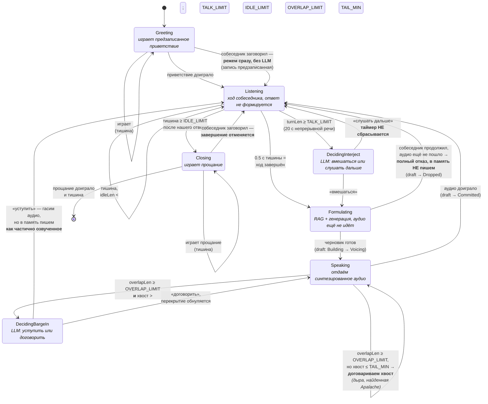

# Конечный автомат диалога — граф состояний

Этот граф — **производное от `dialogue.qnt`**, а не отдельно нарисованная картинка.
Каждое ребро здесь соответствует ровно одному `action` в модели, каждое подписанное
условие — его guard. Если меняется модель, граф правится следом; расхождение между ними
считается багом.

Проверено исчерпывающе (Apalache, `max-steps=14..16`):
8 инвариантов держатся, все 8 состояний достижимы, тупиков нет.

Состояний ровно восемь — семь на диаграмме ниже плюс терминальное `Ended`, которое
нарисовано как `[*]`, потому что из него нет исходящих переходов, кроме самопетли.

## Область моделирования

В автомат входит **только поведение агента по отношению к речи**. Захват аудио, VAD и
транскрибация Whisper сознательно вынесены за его пределы: по требованиям они не
останавливаются **никогда, ни в одном состоянии**. Если внести их внутрь, пространство
состояний удваивается по оси «говорит ли собеседник» без всякой пользы и, что хуже,
появляется ложное впечатление, будто бывают состояния, где мы не пишем звук.



## Почему именно так — неочевидные решения

**Приветствие режется без LLM.** Оно предзаписано, там нечего терять и не о чем
принимать решение: любое начало речи гасит его мгновенно. Решение LLM нужно только там,
где мы можем потерять собственный осмысленный ответ.

**При отказе вмешаться таймер не сбрасывается.** Иначе собеседник, ненадолго
замедливший речь, покупал бы себе ещё 20 секунд, и агент не вмешался бы никогда.
Инвариант `inv_interject_only_after_limit` следит, чтобы решение вообще запускалось
только после реального превышения.

**Брошенный черновик и уступка при перебивании — разные вещи.** Если аудио ещё не
пошло, собеседник ничего не слышал, поэтому ответ выбрасывается целиком и в память не
попадает (`inv_dropped_never_committed`). Если аудио уже шло — он услышал часть, и эта
часть **обязана** попасть в историю, помеченная как частичная, иначе транскрипт
разъедется с тем, что реально прозвучало.

**Договаривание хвоста — это заплатка на дыру в требованиях.** Требования говорили, что
решение о перебивании принимается при перекрытии >1 с **и** остатке >2 с, но молчали о
случае, когда перекрытие есть, а остаток короткий. Apalache выдал контрпример:
`Speaking, speechLeft = TAIL_MIN, overlapLen = OVERLAP_LIMIT, userSpeaking` — не включено
ни одно действие, агент висит с недоигранной репликой. Закрыто договариванием хвоста без
обращения к LLM: перебивать там уже нечего.

**Завершение отменяемо.** Из `Closing` есть выход обратно в `Listening` — позднее
«подождите, ещё вопрос» не должно ронять разговор. У `closingPlays` стоит guard
`not(userSpeaking)`, и это не украшение: без него модель разрешает и доигрывание, и отмену,
не говоря, что выбрать. Реализация тогда выбирает сама, и выбор не виден в модели. Нам всегда
нужна отмена — значит это должна говорить модель, а не соглашение в коде.

## Соответствие порогов и .env

Пороги в модели **порядковые**, а не в секундах: маленькие границы нужны, чтобы Apalache
проверял исчерпывающе. Реальные значения — в `.env`:

| в модели | в `.env` | смысл |
|---|---|---|
| `TALK_LIMIT` | `DIALOGUE_INTERJECT_AFTER_S` | сколько непрерывной речи до решения вмешаться (20 с) |
| `IDLE_LIMIT` | `DIALOGUE_IDLE_HANGUP_S` | сколько тишины после ответа до завершения |
| `OVERLAP_LIMIT` | `DIALOGUE_BARGE_IN_OVERLAP_S` | сколько одновременной речи до решения о перебивании (1 с) |
| `TAIL_MIN` | `DIALOGUE_BARGE_IN_MIN_TAIL_S` | сколько нашего аудио должно остаться, чтобы решение имело смысл (2 с) |

## Как перепроверить

```powershell
.\specs\formal\verify.ps1        # инварианты — ожидаем "все инварианты проверены"
.\specs\formal\reachability.ps1  # достижимость — ожидаем "все состояния достижимы"
```

Оба скрипта сами поднимают сервер Apalache. Обходной путь через `--server-endpoint`
нужен потому, что `quint verify` запускает Apalache через `.bat`, а Node 20+ отказывается
спавнить `.bat` без шелла (следствие исправления CVE-2024-27980) и падает с `EINVAL spawn`.
